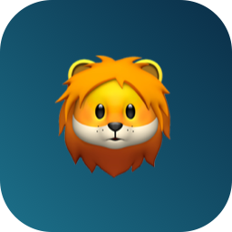
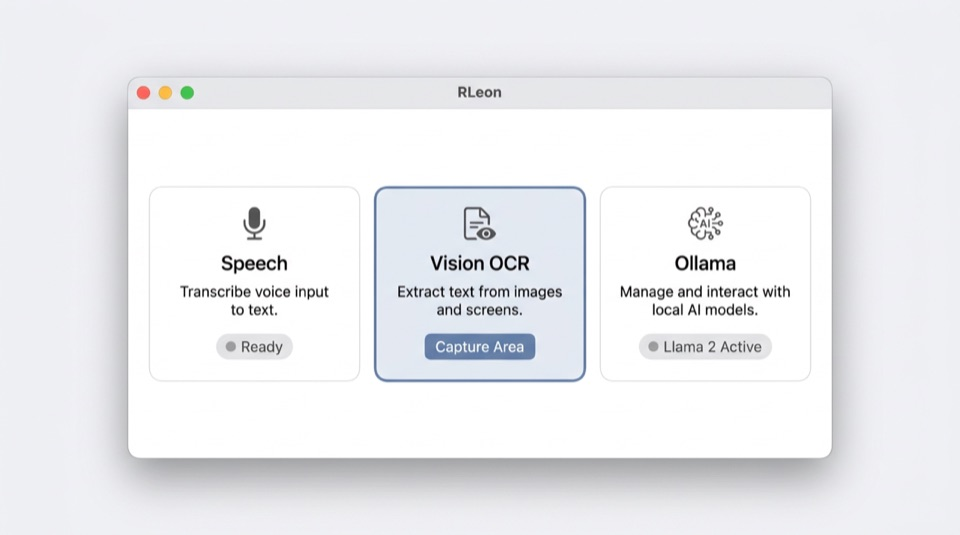

<p align="center">
  
</p>

<h1 align="center">RLeon</h1>

<p align="center">
  <strong>Local speech, vision OCR, and Ollama — with macOS tool calling</strong><br/>
  One window, menu bar status, FN push-to-talk.
</p>

<p align="center">
  <a href="https://github.com/efekurucay/RLeon/actions/workflows/ci.yml"></a>
  
  
  
  <a href="https://ollama.com"></a>
</p>

<p align="center"><sub>CI badge updates after the first successful run on <code>main</code>.</sub></p>

---

## Table of contents

- [About](#about)
- [Screenshots](#screenshots)
- [Features](#features)
- [Requirements](#requirements)
- [Getting started](#getting-started)
- [Configuration](#configuration)
- [Built-in tools](#built-in-tools)
- [MCP (experimental)](#mcp-experimental)
- [Roadmap](#roadmap) · [detailed roadmap](ROADMAP.md)
- [Documentation](#documentation)
- [Contributing](#contributing)
- [Security](#security)
- [License](#license)

---

## About

**RLeon** is an open-source **macOS** app for people who want a **local-first** workflow: dictate with your voice, pull text from the screen or images with Vision, and chat with a **local Ollama** model — optionally with **function calling** into native macOS actions (pasteboard, open apps/URLs, Terminal, type into the focused field, and more).

- **Privacy by default:** speech and OCR run on-device; Ollama is typically `localhost` (you control the model).
- **English UI** and default prompts (all user-visible strings are English).
- **Recognition:** speech defaults to **en-US**; Vision OCR uses **en-US** then **tr-TR** for mixed-language screen text.
- **Safety-first:** high-risk tools (shell, typing into other apps) are **off by default** and gated in Settings.

---

## Screenshots

<p align="center">
  
</p>

<p align="center"><sub>Illustrative preview of the main window layout. For a real capture from your machine, build Release and run <code>scripts/capture_screenshot.sh</code> (saves <code>docs/images/main-window-real.png</code>).</sub></p>

---

## Features

| | |
| --- | --- |
| **Speech** | On-device dictation (`en-US` default) via `SFSpeechRecognizer` |
| **OCR** | Main display capture + image picker + Vision `VNRecognizeTextRequest` |
| **LLM** | Ollama [`/api/chat`](https://github.com/ollama/ollama/blob/main/docs/api.md) with optional [tool calling](https://ollama.com/blog/tool-support) |
| **Tools** | Curated Swift tools + optional **`mcp_*`** bridge hook for future MCP |
| **FN + menu bar** | Short tap vs hold for dictation vs full speech+OCR→LLM pipeline |

---

## Requirements

| | |
| --- | --- |
| **OS** | macOS **14+** |
| **Build** | **Xcode 15+** |
| **LLM (optional)** | [Ollama](https://ollama.com) — use a **tool-capable** model if you want function calling |
| **Permissions** | Microphone, Speech Recognition, Screen Recording (for capture), Accessibility (for typing into other apps) |

---

## Getting started

```bash
git clone https://github.com/efekurucay/RLeon.git
cd RLeon
open SwiftSpeechVisionDemo.xcodeproj
```

1. Select scheme **SwiftSpeechVisionDemo**, destination **My Mac**.
2. **⌘B** to build; product is **`RLeon.app`**.

**Release build (CLI):**

```bash
xcodebuild -scheme SwiftSpeechVisionDemo -configuration Release -destination 'platform=macOS' build
```

Typical output path:

`~/Library/Developer/Xcode/DerivedData/SwiftSpeechVisionDemo-*/Build/Products/Release/RLeon.app`

---

## Configuration

| Topic | What to do |
| --- | --- |
| **Ollama** | Run `ollama serve`; in the app, set base URL (default `http://127.0.0.1:11434`) and model name. |
| **Tool calling** | Enable in the LLM panel; configure which tools are listed under **Settings → Local tools**. |
| **Dangerous tools** | Under **Settings → Dangerous tools & MCP**, allow **Terminal** and/or **type into focused field** (off until you confirm once). **Each** shell command and insertion can show an extra **Run** / **Type** dialog (default on; can be disabled there for trusted setups only). |
| **MCP (`mcp_*`)** | Experimental toggle in the same section; full [swift-sdk](https://github.com/modelcontextprotocol/swift-sdk) wiring is still in progress. |

---

## Built-in tools

Tools are sent to Ollama as OpenAI-compatible `function` definitions when enabled in **Local tools** *and* safety rules allow.

| Tool ID | Description | Risk |
| --- | --- | --- |
| `copy_to_clipboard` | Copy text to the pasteboard | Low |
| `get_app_info` | RLeon name / version | Low |
| `open_application` | Launch app by name or bundle ID | Medium |
| `open_url` | Open URL (Safari or default browser) | Medium |
| `whatsapp_compose` | Open WhatsApp desktop via `whatsapp://` | Medium |
| `run_terminal_command` | Run shell in a new Terminal window | **High** |
| `type_into_focused_field` | Type into focused UI via Accessibility / events | **High** |

**Dangerous tools** (`run_terminal_command`, `type_into_focused_field`) are **not** visible to the model until you enable them under **Settings → Dangerous tools & MCP** (with confirmation). You still enable each tool in **Local tools** if you want it in the list. When a dangerous tool runs, **Terminal** shows the exact command in a modal (unless you turn off “ask before each”); **typing** can likewise ask before inserting into another app.

---

## MCP (experimental)

- [Model Context Protocol](https://modelcontextprotocol.io) — standard way to expose external tools.
- This repo includes **`MCPToolBridge`** as a **stub** (no live `tools/list` / `tools/call` yet). Naming: `mcp_<serverSlug>_<toolName>`.
- To wire it: add **MCP** from [swift-sdk](https://github.com/modelcontextprotocol/swift-sdk) in Xcode (**Swift 6 / Xcode 16+** per upstream), then implement transport + mapping in `MCPToolBridge`.

---

## Roadmap

High level: **releases & trust** (screenshots, GitHub Releases, [notarization notes](docs/NOTARIZATION.md)), **safety** (per-call confirmation for Terminal/typing, length limits), **quality** (tests, CI hardening), then **full MCP** (swift-sdk, “Add MCP server” in Settings).

The **detailed, maintained plan** — what’s done, what’s next, priorities — lives in **[ROADMAP.md](ROADMAP.md)**.

---

## Documentation

| Doc | Purpose |
| --- | --- |
| [CONTRIBUTING.md](CONTRIBUTING.md) | How to build, PRs, GitHub publishing |
| [SECURITY.md](SECURITY.md) | Vulnerability reporting, threat model |
| [CODE_OF_CONDUCT.md](CODE_OF_CONDUCT.md) | Community expectations |
| [docs/ARCHITECTURE.md](docs/ARCHITECTURE.md) | Data flow and key components |
| [docs/NOTARIZATION.md](docs/NOTARIZATION.md) | Optional: signing & notarization for distributing `.app` |
| [ROADMAP.md](ROADMAP.md) | Done vs planned work, near/mid/long term |

---

## Contributing

We welcome **small, focused PRs** — bugfixes, docs, UX polish, or MCP/tooling improvements. See **[CONTRIBUTING.md](CONTRIBUTING.md)** and **[CODE_OF_CONDUCT.md](CODE_OF_CONDUCT.md)**. Before large changes, opening an issue to discuss helps avoid rework.

---

## Security

RLeon can run **local** models and tools, but **shell** and **cross-app typing** are sensitive. Use trusted models only; read **[SECURITY.md](SECURITY.md)** for reporting issues and scope.

---

## License

**MIT** — see [LICENSE](LICENSE).

---

<p align="center">
  <sub>If RLeon helps you, consider starring the repo and sharing feedback.</sub>
</p>
